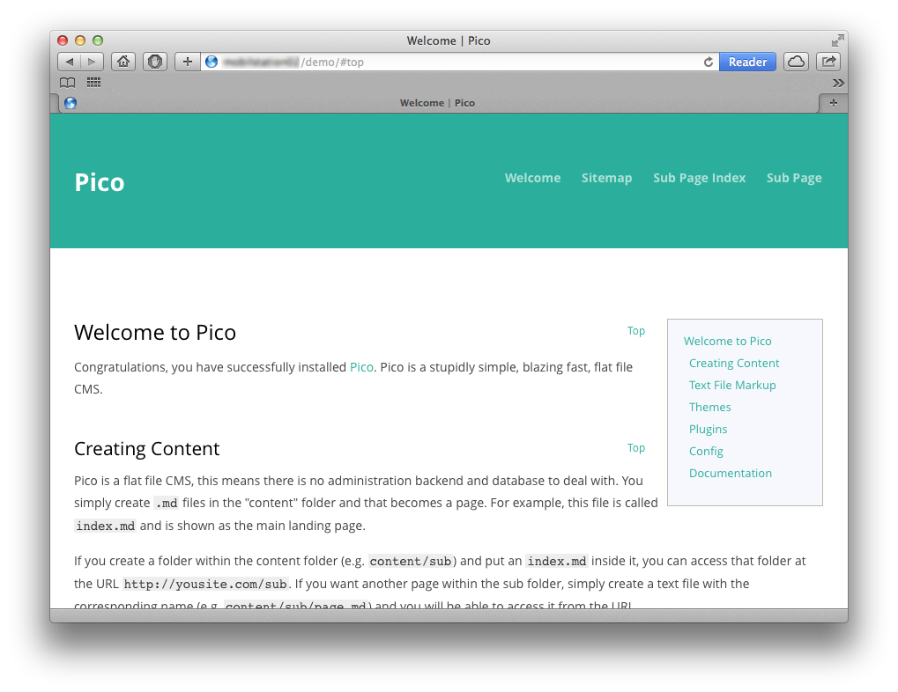

# Table Of Contents

This is a [Phile](http://philecms.github.io/Phile) port of [mcb_TableOfContent](https://github.com/mcbSolutions/Pico-Plugins/tree/master/mcb_TableOfContent) by [mcbSolutions](https://github.com/mcbSolutions).

**Generates a table of contents for the current page.**

Original Copyright notice:

Released under the [MIT license](http://opensource.org/licenses/MIT). Copyright (c) 2013 mcbSolutions.at

## Installation

###Using composer

```bash
composer require pschmitt/tableOfContents:dev-master
```

###But I don't like composer

Clone this repo to `plugins/pschmitt`:

```bash
mkdir -p ~http/plugins/pschmitt
git clone https://github.com/pschmitt/phileTableOfContents.git ~http/plugins/pschmitt/tableOfContents
# You may consider using a submodule
git submodule add https://github.com/pschmitt/phileTableOfContents.git ~http/plugins/pschmitt/tableOfContents
```

Activate it in `config.php`:

```php
$config['plugins'] = array(
    // [...]
    'pschmitt\\tableOfContents' => array('active' => true),
);
```

## Template

* To the `head` of your layout file add:

```html
<link rel="stylesheet" href="{{ base_url }}/plugins/pschmitt/tableOfContents/style.css" media="screen,projection,print">
<link rel="stylesheet" href="{{ base_url }}/plugins/pschmitt/tableOfContents/print.css" media="print">
```

* **Optional - Smooth scrolling:** Add

```html
<script src="{{ base_url }}/vendor/jquery/jquery.min.js"></script>
<script src="{{ base_url }}/plugins/pschmitt/tableOfContents/code.js"></script>
```

* Add `{{ toc_top }}` directly after the `body` tag.
* Add `{{ toc }}` where you want the table of contents displayed.
* Add `{{ top_link }}` if you want a link to top outside the content.
* **Optional - Excerpt twig filter** Inspired by [Twig-filter-plugin](https://github.com/PhileCMS/phileTwigFilters)

Use `{{ content|toc_excerpt }}` to get an excerpt of your posts. This prints the content of the first paragraph.

## Configuration

### toc_depth

**integer**

Only display header h1 to h`n` (where `n` is 1-6)

```php
$config['toc_depth'] = 3;
```

### toc_min_headers

**integer**

Only generate Table of content with at least `n` headers

```php
$config['toc_min_headers'] = 3;
```

### toc_top_txt

**string**

Text to display for "Move to top"

```php
$config['toc_top_txt'] = 'Top';
```

### toc_caption

**string**

Text to display as caption for the table of contents

```php
$config['toc_caption'] = 'Table of contents';
```

### toc_anchor

**bool**

Set to false, if you like to add your own anchor

```php
$config['toc_anchor'] = false;
```

### Note

If you use `$config['toc_anchor'] = true;` then `{{ toc_top }}` will be disabled.

## Screenshot


